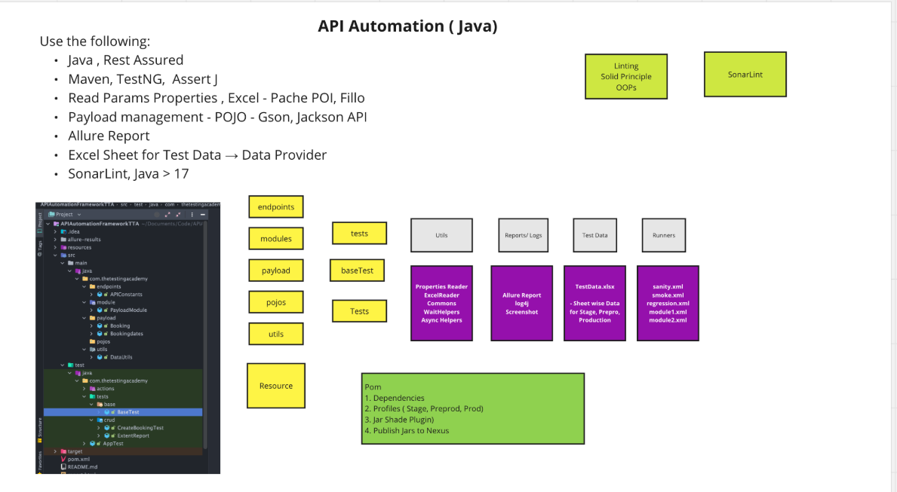
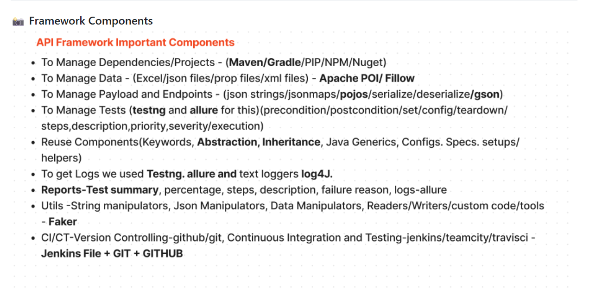
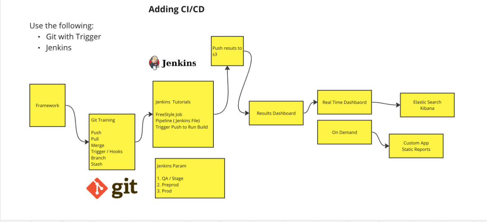
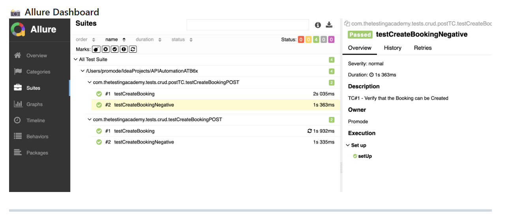

**🚀 API AUTOMATION FRAMEWORK USING REST ASSURED (JAVA)**

👨‍💻 Author: Abhishek Anand
🔗 Repository: https://github.com/asr2646/APIAutomationFramework.git

A powerful, scalable, and CI/CD-ready API Automation Framework built using Rest Assured + Java, designed to automate Restful Booker CRUD APIs following industry best practices.

📌 PROJECT HIGHLIGHTS

✅ End-to-End REST API Automation
✅ Hybrid Framework Design
✅ CI/CD Enabled with Jenkins
✅ Parallel Test Execution
✅ Allure Advanced Reporting
✅ Integration Testing Included
✅ Clean Code & Maintainable Structure

▶️ RUN THE TEST SUITE
mvn test -Dsurefire.suiteXmlFiles=testng.xml

📸 Execution Preview

🛠️ TECH STACK
🔧 Tool	📘 Description
☕ Java	JDK > 22
🧪 Rest Assured	API Automation
📦 Maven	Build Tool
✅ TestNG	Test Execution
📊 Apache POI	Data Handling
🧠 AssertJ	Advanced Assertions
🔁 Jackson + GSON	Serialization / Deserialization
📝 Log4j	Logging
📈 Allure	Advanced Reporting
🧱 Hybrid Framework	Scalable Design
🤖 Jenkins	CI/CD Pipeline
🗂️ FRAMEWORK ARCHITECTURE

🔁 CI/CD EXECUTION (JENKINS)

⚙️ MAVEN CONFIGURATION (pom.xml)
org.apache.maven.plugins
maven-surefire-plugin
3.3.0
${suiteXmlFile}

▶️ Run Using

mvn clean test -DsuiteXmlFile=testng.xml

⚡ PARALLEL EXECUTION

✅ Faster test execution
✅ Optimized resource usage

🔗 INTEGRATION TEST EXECUTION
mvn clean test -DsuiteXmlFile=testng-integration.xml

Includes:

✅ Token Creation
✅ Booking Creation
✅ Update Booking
✅ Delete Booking

📊 ALLURE REPORTING

▶️ Serve Allure Report

allure serve allure-results/

📸 Allure Dashboard Screenshot
(Add Allure report image here)

🧾 ALLURE SETUP GUIDE
1️⃣ Install Allure (Mac)
brew install allure

2️⃣ Add Dependency
io.qameta.allure
allure-testng
2.13.0

3️⃣ Add Allure Plugin
io.qameta.allure
allure-maven
2.10.0
2.13.0

4️⃣ Generate Report
mvn clean test
allure generate target/allure-results --clean -o allure-report
allure open allure-report

🧪 POSTMAN ASSIGNMENT SCENARIOS
✅ CRUD Operations with Authorization

1️⃣ Create ➝ Update ➝ Get ➝ Verify
2️⃣ Create ➝ Delete ➝ Verify Not Found
3️⃣ Get Existing ➝ Update ➝ Verify
4️⃣ Create ➝ Delete
5️⃣ Invalid Payload Validation
6️⃣ Update on Deleted ID

✅ Single Request Validation

✔️ Status Code
✔️ Headers
✔️ Response Body

📦 POSTMAN COLLECTION

✅ Restful Booker CRUD APIs
✅ Test Scripts from Snippets
✅ Hardcoded Integration Scenarios

🌟 WHY USE THIS FRAMEWORK?

✅ Clean Architecture
✅ CI/CD Ready
✅ Parallel Execution
✅ Advanced Assertions
✅ Real-World API Scenarios
✅ Rich Reporting with Dashboards

📩 CONNECT WITH ME

🔗 LinkedIn: https://www.linkedin.com/in/abhishek-anand-270851190/

🌐 Portfolio: https://abhishek-anand-zk6adnv.gamma.site/